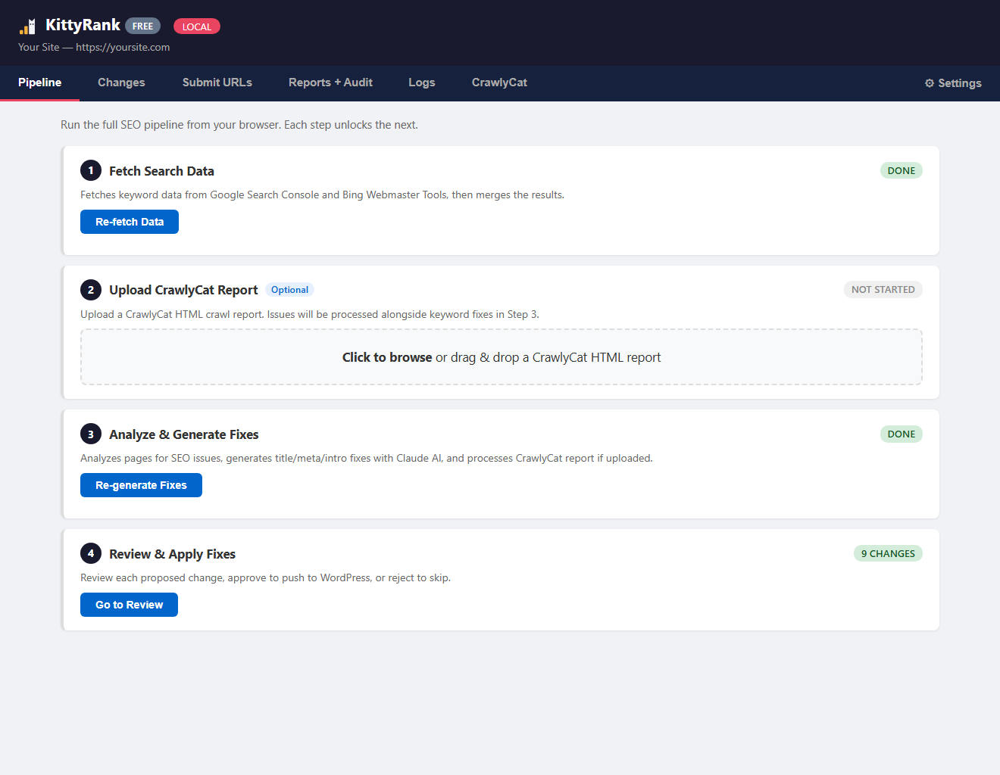
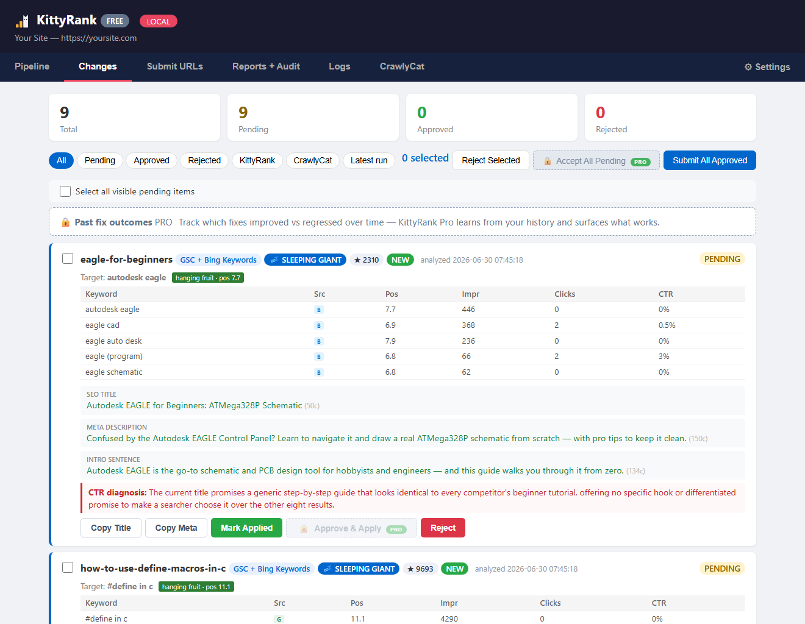
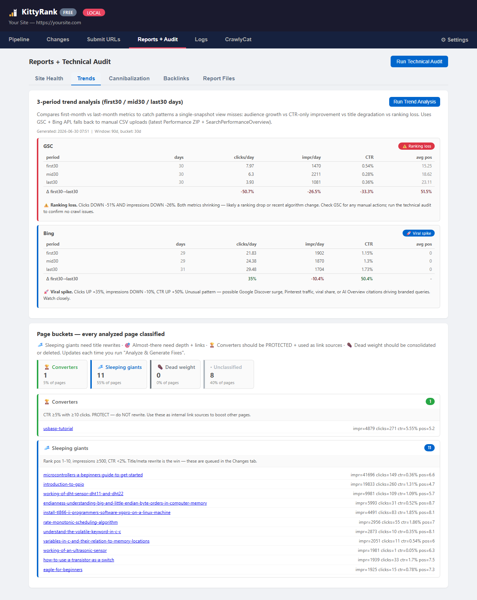

# KittyRank — OSS Edition

Run a full SEO audit on your WordPress site in 5 minutes. See what's broken,
what's underperforming, what's worth a backlink push. Get AI-generated title
rewrites for your sleeping giants — apply them yourself in Yoast or your
SEO plugin of choice.

Built and battle-tested on [nerdyelectronics.com](https://nerdyelectronics.com)
— a free embedded-systems learning resource.

```
─────────────────────────────────────────────────────────────────────────────
  TYPICAL FINDINGS ON A REAL SITE (one run on nerdyelectronics)
─────────────────────────────────────────────────────────────────────────────
  ✓  3 active 404 URLs with traffic (need removal or restoration)
  ✓  85 URLs that 301-redirect but Bing/GSC haven't consolidated yet
  ✓  11 WP attachment pages indexed (one Yoast setting fixes all)
  ✓  72 high-traffic pages with zero backlinks (outreach targets)
  ✓  9 sleeping-giant pages with CTR under expected (title rewrite wins)
  ✓  23 referring domains classified by authority
  ✓  3-period trend analysis: clicks ↑38% but impressions ↓18% on Bing
       → "viral spike" pattern flagged for monitoring
─────────────────────────────────────────────────────────────────────────────
```

---

## What you get (free)

### 4 audit modules
- **Technical health** — 404s with traffic, 5xx server errors, 301s not yet consolidated, attachment-page waste, duplicate URL structures, sitemap pollution, unprotected high-traffic pages
- **Trend analysis** — 3-period bucketing (first30 / mid30 / last30 days), 7 signal classifications (audience growth, viral spike, title degradation, ranking loss, CTR-only improvement, etc.)
- **Backlink audit** — referring domain classification, outreach-target ranking (high-impressions + zero backlinks)
- **Cornerstone link auditor** — Type A (content pillar) vs Type B (architectural hub) classification, with reciprocal-gap + overlap-gap detection

### Page bucket classification
Every page on your site is automatically classified into one of:
- 💤 **Sleeping giant** — ranks well, CTR low (title rewrite wins)
- 🎯 **Almost there** — page 2, push to page 1 with depth + links
- 🏆 **Converter** — high CTR, high clicks (PROTECT, use as link source)
- ⚰️ **Dead weight** — consolidate, redirect, or delete

### Claude-generated fix proposals
- For each sleeping-giant page, Claude generates new title + meta description
- Quality gates: validates length, dangling words, keyword density, no truncation
- Output: JSON + markdown report
- You apply manually in Yoast / Rank Math / your CMS

### URL submission
- Submit URLs to Bing Webmaster Tools for faster re-crawl
- Google has no general recrawl API — keep your sitemap fresh and use Search Console → Request Indexing

### CrawlyCat integration
- Bundled crawl-error fix workflow for broken-internal-link cleanup

---

## What Pro adds

Free finds the problems and drafts the fixes — you apply them yourself. **Pro applies
them for you, and does the harder, riskier operations Free won't touch:**

- ⚡ **One-click apply to WordPress** — approve a fix and it's written via the REST API. No copy-paste.
- 📦 **Batch apply** — accept all pending / submit all approved in one pass.
- 🔗 **Page consolidation** — safely merge duplicate or competing pages: rewrites internal links site-wide, puts the 301 in place, drafts the merged content.
- 🤝 **Competing-page analysis** — Claude compares two pages fighting for the same query and drafts the merge (or says keep both, and why).
- 🧵 **Auto internal-linking** — inserts contextual internal links into your posts.
- 🗑️ **URL removal** — Bing removal for 404 cleanup (Google via the GSC Removals tool).
- 📈 **Fix-outcome tracking** — grades every change against fresh search data weeks later, so you see what **actually** moved rankings. This is the closed loop.
- 📄 **Branded PDF reports** — client-ready monthly deliverables.

The free version is genuinely useful on its own — it finds everything and drafts the fixes.
Pro is for when applying them by hand (and doing consolidation safely) isn't worth your time.

**Get in touch**: open an issue on [KittyRank/kittyrank](https://github.com/KittyRank/kittyrank/issues)

---

## Quick start (5 minutes)

### Prerequisites
- Python 3.10+
- A WordPress site you own with Yoast SEO (or similar) installed
- Google Search Console verified for your site
- Bing Webmaster Tools verified for your site
- (Optional) Anthropic Claude API key for AI fix proposals

### Install

```bash
git clone https://github.com/KittyRank/kittyrank.git
cd kittyrank
pip install -r requirements.txt
cp config.example.py config.py
# Edit config.py with your site domain + API keys
```

### Run

```bash
# Full pipeline (fetch → analyze → claude proposals → markdown report)
python run.py audit

# Single steps
python run.py fetch          # GSC + Bing + GA4 data fetch
python run.py analyze        # Page analysis + bucket classification
python run.py claude         # AI fix proposals (uses your Anthropic key)
```

Output lands in `output/` — markdown reports, JSON, fix proposals.

### Dashboard (browser)

Prefer a UI over the CLI? Launch the web dashboard — it bundles the setup
wizard, data fetch, fix review, and report viewing in one place.

```bash
python review.py                  # Start dashboard (default port 8090)
python review.py --port 8092      # Use a custom port (e.g. alongside another instance)
```

Then open http://localhost:8092 (it also auto-opens in your browser).
Press `Ctrl+C` to stop.

---

## Screenshots

**Run the whole pipeline from your browser** — fetch, analyze, generate, review; each step unlocks the next.



**Review every AI-proposed title + meta rewrite** before you apply it.



**3-period trend analysis + technical audit** — see momentum and what's broken.



> Screenshots use demo data on a placeholder domain.

---

## Architecture

```
config.py                  # Your site config + API keys (gitignored)
audit/
  technical_audit.py       # HTTP codes, 404s, duplicates, attachment waste
  trend_analysis.py        # 3-period bucketing, 7 signals
  backlink_audit.py        # Domain classification, outreach targets
  cornerstone_audit.py     # Pillar/hub link gap detection
fetch/
  fetch.py                 # GSC searchAnalytics
  fetch_bing.py            # Bing GetPageStats + GetCrawlIssues
  fetch_ga4.py             # GA4 engagement metrics (optional)
  merge_data.py            # Unifies GSC + Bing keyword data
analyze/
  claude_analyze.py        # Claude fix-proposal generation (no auto-apply)
  seo_quality.py           # Title/meta validators, CTR curves
submit/
  submit_urls.py           # Bing URL submission (Google via sitemap/GSC)
crawl/
  crawl_fix.py             # CrawlyCat broken-link automation
report/
  report_generator.py      # Markdown + HTML output from audit JSON
```

---

## License

Apache License 2.0 — see [LICENSE](./LICENSE) and [NOTICE](./NOTICE).

You may use, modify, and redistribute this software freely (commercial use OK).
Attribution required: keep the NOTICE file with any derivative work.

---

## Want help running it?

Prefer not to run the pipeline yourself? We offer **managed SEO, done for you** —
for any content-driven WordPress site. You get the results without touching a terminal.

**From $199/mo per site.** Includes setup, monthly audits, one-click fix application,
and branded PDF reports.

Reach out at **hello@kittyrank.com**, or open a [GitHub issue](https://github.com/KittyRank/kittyrank/issues).

## Documentation

- [Setup guide](docs/SETUP.md) — API keys, first run, troubleshooting
- [User guide](docs/USER-GUIDE.md) — the workflow loop, all five audits, manual-apply flow
- [Google Search Console — service account](docs/GSC-SERVICE-ACCOUNT.md) — the JSON key path (no OAuth)
- [Google login (OAuth)](docs/GOOGLE-LOGIN.md) — one-click Connect Google
- [Bing Webmaster Tools](docs/BING-SETUP.md) — get your API key
